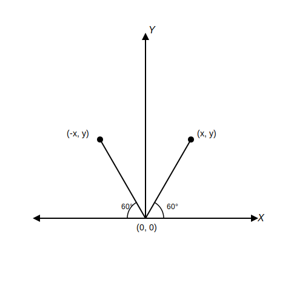
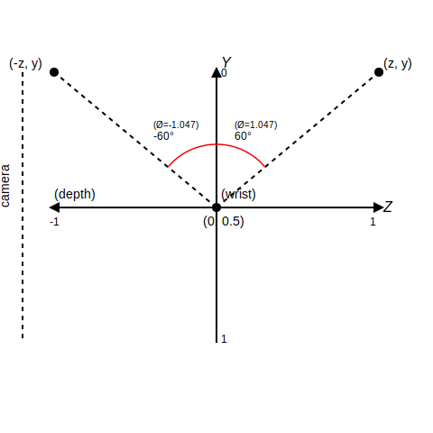

# Equations Reference

## Overview
- **Version**: 0.0.1
- **Description**: Documentation about equations used in this app
- **Reference**: Linear Interpolation, `Math.atan2(y, x)`

## Table of Contents
- **Hand Rotation**
  - `Math.atan2(y, x)` function
  - Normalization
- **Mapping Parameter Output**
  - Linear Interpolation

## **Hand Rotation**

### `Math.atan2(y, x)` function

> The `Math.atan2()` static method returns the angle in the plane (in radians) between the positive x-axis and the ray from (0, 0) to (x, y), for Math.atan(y, x).
Source: [MDN](https://developer.mozilla.org/en-US/docs/Web/JavaScript/Reference/Global_Objects/Math/atan2)

The `atan2()` function is essentially the inverse of the `atan()` function. To understand how `atan2()` works, you first need to understand `atan()`. I won't go into a deep dive on these functions here. If you'd like more details, see this reference from [CSS-Tricks](https://css-tricks.com/almanac/functions/a/atan2/).

Let's look at the diagram below to understand the concept of `atan2()` more easily.

The diagram above represents the angle in radians between the positive/negative x-axis and the ray from (0, 0) to point (-x, y) and point (x, y), using the formula `atan2(y, x)`. I will use this function to calculate the angle in radians from hand rotation, but I need some adjustments.
 
I decided to use the wrist and middle fingertip landmarks as the base points to detect hand rotation. For simplicity, let's define variables for the wrist and middle fingertip as follows.

- wrist => (wrist.z, wrist.y)
- middle fingertip => (midtip.z, midtip.y). 

Assume that both landmarks are placed on the y-axis in the initial state, and that the rotation happens around the z-axis (in MediaPipe, the z-axis is perpendicular to the camera).
 
What I need is the angle in radians between the y-axis and the ray from the joint formed by the wrist and middle fingertip. If i represent this in a diagram, it looks like this.

I make the wrist the pivot point, because `atan2()` calculates the angle of the ray from the origin point (0, 0). I need to adjust the coordinates so that the middle fingertip position becomes relative to the wrist. The wrist point always has a greater value than the middle fingertip, and the middle fingertip always moves toward and away from the camera, so the adjustment formulas look like this.

$$
Δy = wrist.y - midtip.y
$$
$$
Δz = midtip.z - wrist.z
$$

Because I need the angle in radians between the y-axis and the ray from (0, 0) to the point (Δz, Δy), I use the `atan2()` function with the following parameters: `Math.atan2(Δz, Δy)`.

### Normalization

I define the max rotation to be 60° both toward and away from the camera. First, I convert this angle to radians. A full circle contains 2π radians.

$$
2\pi = 360°
$$

To find the radians value for 60°, let ($x$) be the value in radians.

$$
\begin{equation*}
\begin{aligned}
\frac {x}{2\pi} &= \frac {60}{360} 
\\
x &= \frac {120\pi} {360}
\\
x &= \frac {\pi}{3}
\end{aligned}
\end{equation*}
$$

From the equation above, the value in radians is ($\frac{\pi}{3}$), which is approximately 1.047 (away from the camera) or -1.047 (toward the camera).

$$
-1.047 \leq angle \leq 1.047
$$

After calculating the max angle in radians, I normalize the angle. Normalization makes later parameter calculations easier. I normalize the value to the range -1 to 1. This kind of normalization is commonly used in DAW (Digital Audio Workstation) applications.

$$
\begin{equation*}
\frac {-1.047}{1.047} \leq \frac {angle}{1.047} \leq \frac {1.047}{1.047}
\end{equation*}
$$

$$
\begin{equation*}
-1 \leq \frac {angle}{1.047} \leq 1
\end{equation*}
$$
