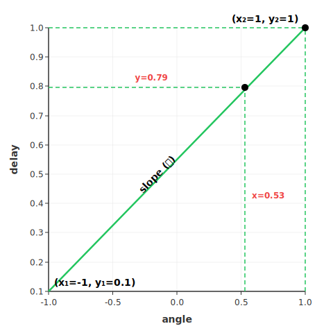

# Equations Reference

## Overview

- **Version**: 0.0.1
- **Description**: Documentation about equations used in this app
- **Reference**: Linear Interpolation, `Math.atan2(y, x)`

## Table of Contents

- **Hand Rotation**
  - `Math.atan2(y, x)` function
  - Normalization
- **Mapping Parameter Output**
  - Linear Interpolation
- **Examples**

## **Hand Rotation**

### `Math.atan2(y, x)` function

> The `Math.atan2()` static method returns the angle in the plane (in radians) between the positive x-axis and the ray from (0, 0) to (x, y), for Math.atan(y, x).
> <br/> Source: [MDN](https://developer.mozilla.org/en-US/docs/Web/JavaScript/Reference/Global_Objects/Math/atan2)

The `atan2()` function is essentially the inverse of the `atan()` function. To understand how `atan2()` works, you first need to understand `atan()`. I won't go into a deep dive on these functions here. If you'd like more details, see this reference from [CSS-Tricks](https://css-tricks.com/almanac/functions/a/atan2/).

Let's look at the diagram below to understand the concept of `atan2()` more easily.


The diagram above represents the angle in radians between the positive/negative x-axis and the ray from (0, 0) to point (-x, y) and point (x, y), using the formula `atan2(y, x)`. I will use this function to calculate the angle in radians from hand rotation, but I need some adjustments.
<br/>
I decided to use the wrist and middle fingertip landmarks as the base points to detect hand rotation. For simplicity, let's define variables for the wrist and middle fingertip as follows.

- wrist => (wrist.z, wrist.y)
- middle fingertip => (midtip.z, midtip.y).

Assume that both landmarks are placed on the y-axis in the initial state, and that the rotation happens around the z-axis (in MediaPipe, the z-axis is perpendicular to the camera).
<br/>
What I need is the angle in radians between the y-axis and the ray from the joint formed by the wrist and middle fingertip. If i represent this in a diagram, it looks like this.


I make the wrist the pivot point, because `atan2()` calculates the angle of the ray from the origin point (0, 0). I need to adjust the coordinates so that the middle fingertip position becomes relative to the wrist. The wrist point always has a greater value than the middle fingertip, and the middle fingertip always moves toward and away from the camera, so the adjustment formulas look like this.

$$
Δy = wrist.y - midtip.y
$$

$$
Δz = midtip.z - wrist.z
$$

Because I need the angle in radians between the y-axis and the ray from (0, 0) to the point (Δz, Δy), I use the `atan2()` function with the following parameters: `Math.atan2(Δz, Δy)`.

### Normalization

I define the max rotation to be 60° both toward and away from the camera. First, I convert this angle to radians. A full circle contains 2π radians.

$$
2\pi = 360°
$$

To find the radians value for 60°, let ($x$) be the value in radians.

$$
\begin{equation*}
\begin{aligned}
\frac {x}{2\pi} &= \frac {60}{360}
\\
x &= \frac {120\pi} {360}
\\
x &= \frac {\pi}{3}
\end{aligned}
\end{equation*}
$$

From the equation above, the value in radians is ($\frac{\pi}{3}$), which is approximately 1.047 (away from the camera) or -1.047 (toward the camera).

$$
-1.047 \leq angle \leq 1.047
$$

After calculating the max angle in radians, I normalize the angle. Normalization makes later parameter calculations easier. I normalize the value to the range -1 to 1. This kind of normalization is commonly used in DAW (Digital Audio Workstation) applications.

$$
\begin{equation*}
\frac {-1.047}{1.047} \leq \frac {angle}{1.047} \leq \frac {1.047}{1.047}
\end{equation*}
$$

$$
\begin{equation*}
-1 \leq \frac {angle}{1.047} \leq 1
\end{equation*}
$$

## Mapping Parameter Output

### Linear Interpolation

> In mathematics, linear interpolation (sometimes lerp) is a method of curve fitting using linear polynomials to construct new data points within the range of a discrete set of known data points.
> <br/>Source: [Wikipedia](https://en.wikipedia.org/wiki/Linear_interpolation)

#### Why?

In this apps there are 3 instruments, each with 3 parameters. I will use bass instrument and its delay parameter as an example. The delay in Tone.js has a range from 0.0 to 1.0, but i will use 0.1 to 0.9. Because my application can change output parameter using hand rotation gesture, I need to map the rotation range (-1 to 1) to the delay range (0.1 to 0.9). To achieve this, I use **Linear Interpolation**.

#### How?

**Linear Interpolation** is commonly used in animation movement. Let's look at the diagram below.



> at the initial state, (y) value is not defined yet. Assume that (y) value is unkown.

based on diagram above, i mapped the variables and the values like this.

$$
\begin{aligned}
& x_1 = -1 \\
& x_2 = 1 \\
& y_1 = 0.1 \\
& y_2 = 1 \\
\end{aligned}
$$

<br/>

Variable ($x_1$) is the min rotation, and ($x_2$) is the max rotation. Variable ($y_1$) is the min delay value, and ($y_2$) is the max delay value. These values are used to find the slope ($\alpha$). In Linear Interpolation, the slope is constant along straight line between two known data points. Based on the graph above, the slope is defined by the points ($x_1$, $y_1$) and ($x_2$, $y_2$).

$$
\begin{aligned}
slop(\alpha)=\frac{y_2-y_1}{x_2-x_1}
\end{aligned}
$$

Linear Interpolation has the following formula.

$$
\begin{aligned}
y_1+\alpha\times(x-x_1)
\end{aligned}
$$

That formula is used to find the value of ($y$) for a given ($x$), where ($x$) is the radians value from hand rotation in the range of -1 to 1 ($x_1$ to $x_2$). The variable ($y$) is the delay value in the range of 0.0 to 0.9 ($y_1$ to $y_2$). This formula causes the delay value to change based on hand rotation.

The formula can be simplified because the rotation range is constant, from -1 to 1 ($x_1$ to $x_2$). The parameter range for each instrument may have different values, so ($y_1$ to $y_2$) remains variable.

$$
\begin{aligned}
&slop(\alpha)=\frac{y_2-y_1}{x_2-x_1} \\
&slop(\alpha)=\frac{y_2-y_1}{1-(-1)} \\
&slop(\alpha)=\frac{y_2-y_1}{2}
\end{aligned}
$$

$$
\begin{aligned}
& y=y_1+\alpha\times(x-x_1) \\
& y=y_1+\frac{y_2-y_1}{2}\times(x-x_1) \\
& y=y_1+\frac{y_2-y_1}{2}\times(x-(-1)) \\
& y=y_1+(y_2-y_1)\times\frac{x+1}{2}
\end{aligned}
$$

## Examples
Let's assign values to create a simulation. Assume the hand rotates away from camera by about $30\degree$, and the landmarks have values like these.

$$
\begin{aligned}
& wrist.z = 0 \\
& middleTip.z = 0.1256 \\
& wrist.y = 0.70 \\
& middleTip.y = 0.50 \\
\end{aligned}
$$

The radians value can be calculated as follows.

$$
\begin{aligned}
& dy = wrist.y - midtip.y \\
& dz = midtip.z - wrist.z \\
\end{aligned}
$$

$$
\begin{aligned}
& dy = 0.70 - 0.50 \\
& dz = 0.1256 - 0 \\
\end{aligned}
$$


$$
\begin{aligned}
& Math.atan2(dz, dy)= 0.5607
\end{aligned}
$$

The radians value is `0.5607`, but it needs to be normalized, so the result is as follows.

$$
\begin{aligned}
& \frac{0.5607}{1.047}=0.5355
\end{aligned}
$$

The formula will be implemented in `calculateZTilt` function. In the following code, the `Math.max` function is prevent the angle in radians from exceeding the limit defined earlier.

```typescript
export function calculateZTilt(landmarks) {
  const wrist = landmarks[0];
  const middleTip = landmarks[12];
  const dy = wrist.y - middleTip.y;
  const dz = middleTip.z - wrist.z;
  const rawAngle = Math.atan2(dz, dy);
  return Math.max(-MAX_Z_TILT, Math.min(MAX_Z_TILT, rawAngle));
}
```

The radians value `0.5355` that found earlier is ($x$). The remaining step is to find the delay value, which is ($y$).

I will use the simplified formula defined earlier.

$$
\begin{aligned}
& y=y_1+(y_2-y_1)\times\frac{x+1}{2} \\
\end{aligned}
$$

$$
\begin{aligned}
& y=0.1+(1-0.1)\times\frac{0.5355+1}{2} \\
& y=0.1+0.9\times0.7677 \\
& y=0.1+0.6909 \\
& y=0.7909
\end{aligned}
$$

The delay value ($y$) is `0.7909`.

The formula will be implemented in `updateBassParams` function. The `params.delay` value is an angle in radians, wich is used as the input variable ($x$).

```typescript
  const feedback = 0.1 + ((params.delay + 1) / 2) * (1 - 0.1);
  delay.feedback.value = feedback;

```

