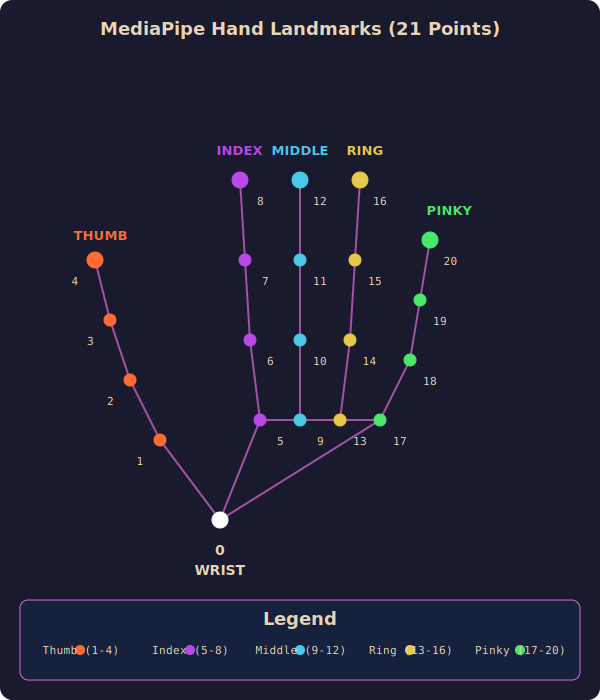

# MediaPipe Hand Landmarks — Visual Diagram

## Quick Reference Table

| Landmark | Name | Finger | Joint |
|---|---|---|---|
| 0 | WRIST | — | Wrist |
| 1 | THUMB_CMC | Thumb | Base (palm) |
| 2 | THUMB_MCP | Thumb | Middle |
| 3 | THUMB_IP | Thumb | Upper |
| 4 | THUMB_TIP | Thumb | Tip |
| 5 | INDEX_MCP | Index | Base |
| 6 | INDEX_PIP | Index | Middle |
| 7 | INDEX_DIP | Index | Upper |
| 8 | INDEX_TIP | Index | Tip |
| 9 | MIDDLE_MCP | Middle | Base |
| 10 | MIDDLE_PIP | Middle | Middle |
| 11 | MIDDLE_DIP | Middle | Upper |
| 12 | MIDDLE_TIP | Middle | Tip |
| 13 | RING_MCP | Ring | Base |
| 14 | RING_PIP | Ring | Middle |
| 15 | RING_DIP | Ring | Upper |
| 16 | RING_TIP | Ring | Tip |
| 17 | PINKY_MCP | Pinky | Base |
| 18 | PINKY_PIP | Pinky | Middle |
| 19 | PINKY_DIP | Pinky | Upper |
| 20 | PINKY_TIP | Pinky | Tip |

---

## Finger Grid (Top-to-Bottom)

| Thumb | Index | Middle | Ring | Pinky |
|---|---|---|---|---|
| **4** tip | **8** tip | **12** tip | **16** tip | **20** tip |
| **3** upper | **7** upper | **11** upper | **15** upper | **19** upper |
| **2** middle | **6** middle | **10** middle | **14** middle | **18** middle |
| **1** base | **5** base | **9** base | **13** base | **17** base |

**Wrist: 0** (connected to index base and pinky base)

---

## Skeleton Connection Tree

```
0 (WRIST)
├── 1 → 2 → 3 → 4          [Thumb]
├── 5 → 6 → 7 → 8          [Index]
│   └── 9 → 10 → 11 → 12   [Middle]
│       └── 13 → 14 → 15 → 16  [Ring]
│           └── 17 → 18 → 19 → 20  [Pinky]
```

---

## SVG Visual Diagram



---

## Coordinate System Deep Dive

### Per-Landmark Coordinates

Each of the 21 landmarks has its **own** `{x, y, z}` coordinate object:

```js
landmarks = [
  { x: 0.5, y: 0.8, z: -0.02 },   // landmark 0 (WRIST)
  { x: 0.48, y: 0.75, z: -0.01 }, // landmark 1 (Thumb CMC)
  { x: 0.46, y: 0.70, z: 0.01 },  // landmark 2 (Thumb MCP)
  // ... all the way to landmark 20
]
```

### Value Ranges

| Coordinate | Range | Meaning |
|---|---|---|
| **x** | `0.0` → `1.0` | Horizontal position (0 = left edge, 1 = right edge) |
| **y** | `0.0` → `1.0` | Vertical position (0 = top edge, 1 = bottom edge) |
| **z** | Relative depth | Depth relative to wrist (landmark 0). **Smaller z = closer to camera. Larger z = farther from camera.** |

### Z-Coordinate Explained (Wrist as Reference)

The wrist landmark (0) serves as the **origin/reference plane** for depth:

```js
// Wrist is always ≈ 0 (the reference point)
landmarks[0] = { x: 0.5, y: 0.5, z: 0.001 }  // z ≈ 0

// Other landmarks are relative to wrist:
landmarks[8]  = { x: 0.4, y: 0.3, z: -0.05 } // Index tip = CLOSER to camera than wrist
landmarks[12] = { x: 0.5, y: 0.2, z: +0.03 } // Middle tip = FARTHER from camera than wrist
```

**Key rule:** Compare z values directly — the smaller value is always closer to the camera.

### Coordinate Axes Visualization

```
     y=0 (top of frame)
       ↑
       │
x=0 ←──┼──→ x=1 (right of frame)
(left) │
       │
       ↓
   y=1 (bottom of frame)

z-axis: depth (perpendicular to screen)
  Smaller z → landmark is CLOSER to camera
  Larger z  → landmark is FARTHER from camera
  z ≈ 0     → landmark is at same depth as wrist (reference plane)
```

### Practical Examples

| What you want to check | Code | Explanation |
|---|---|---|
| Index fingertip horizontal position | `landmarks[8].x` | `0.5` = center, `0.2` = left side |
| Index fingertip vertical position | `landmarks[8].y` | `0.1` = near top, `0.9` = near bottom |
| Is index finger extended? | `landmarks[8].y < landmarks[6].y` | Tip is above PIP joint (remember: y=0 is top) |
| Is palm facing camera? | `landmarks[0].z > landmarks[9].z` | Knuckles (landmark 9) are closer to camera than wrist (landmark 0). Smaller z = closer, so `middleMcp.z < wrist.z` means palm faces camera. |
| Hand rotation angle | `Math.atan2(landmarks[8].y - landmarks[5].y, landmarks[8].x - landmarks[5].x)` | Direction from index base to tip |

### Mirror Flip (Important for Your App)

Since your app mirrors the video feed, you must flip the x-coordinate when converting to screen position:

```js
// In renderer.js and tracking.js
const screenX = (1 - landmark.x) * app.screen.width;
const screenY = landmark.y * app.screen.height;
```

**Why?** MediaPipe gives `x=0.2` for the left side of the frame, but your mirrored video shows the opposite. So `1 - 0.2 = 0.8` gives the correct mirrored screen position.

### How Your App Uses Coordinates

| Feature | Coordinates Used | File |
|---|---|---|
| Finger extension | `tip.y < pip.y` for index/middle/ring/pinky | `gesture/hooks.js` |
| Thumb extension | Distance comparison: `tip-to-mcp vs ip-to-mcp` | `gesture/hooks.js` |
| Hand rotation | `atan2(tip.y - mcp.y, tip.x - mcp.x)` using landmarks 5 and 8 | `gesture/hooks.js` |
| Palm detection | `wrist.z > middleMcp.z` (landmarks 0 and 9). When palm faces camera, knuckles are closer (smaller z) than wrist. | `gesture/hooks.js` |
| Hand distance | Euclidean distance between centroids of all 21 landmarks | `gesture/hooks.js` |
| Animation tracking | 6 key joints: `[0, 1, 5, 9, 13, 17]` | `animation/tracking.js` |
| Effect positioning | Convert normalized to screen coords with mirror flip | `animation/renderer.js` |

### Coordinate Value Differences by Scenario

| Scenario | Typical x | Typical y | Typical z |
|---|---|---|---|
| Hand on left side of frame | `0.1` – `0.4` | `0.3` – `0.7` | Varies |
| Hand on right side of frame | `0.6` – `0.9` | `0.3` – `0.7` | Varies |
| Hand near top of frame | `0.3` – `0.7` | `0.1` – `0.3` | Varies |
| Hand near bottom of frame | `0.3` – `0.7` | `0.7` – `0.9` | Varies |
| Fingertip closer than wrist | Same as hand | Same as hand | `-0.05` to `-0.01` |
| Fingertip farther than wrist | Same as hand | Same as hand | `0.01` to `0.05` |
| Palm flat facing camera | Centered | Centered | All landmarks similar z |
| Hand rotated sideways | Shifted | Shifted | Thumb and pinky z differ significantly |
